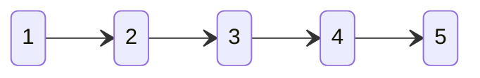
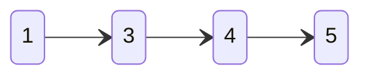
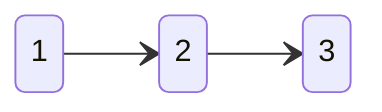
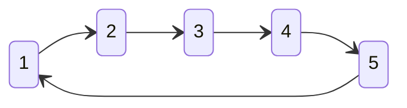
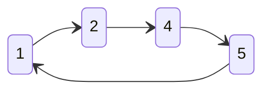
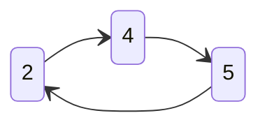
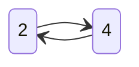

# 实验九

## 实验目的

- 练习手动分配和释放内存
- 练习使用链表存储和操作数据
- 练习字符串的高级处理

## 基础编程

### P9.1 链表切分

现有一个链表A，其中每个节点是如下的结构体：

```c
typedef struct Node {
    int value;
    struct Node * next;
} Node;
```

请编写函数

```c
Node * slice(Node * A, int m, int n);
```

将链表A中从第m个节点（含）到第n个节点（不含）删除（从0开始计数），返回剩余链表的头节点指针。如果m超过了链表的长度，则不对链表执行任何操作；如果n超过了链表的长度，相当于将链表从第m个节点开始到末尾删去。在OJ上提交你所编写的函数。请不要修改上面给出的函数原型。

例如，如果有链表A



则调用`slice(A, 1, 2)`后的结果为：



而调用`slice(A, 3, 6)`后的结果为



#### 输入

本题无输入

#### 输出

本题无输出

#### 注意

**仅提交slice函数。**


## 进阶编程

### AP9.1 链表合并

现有两个链表A和B，其中每个节点是如下的结构体：

```c
typedef struct Node {
    int value;
    struct Node * next;
} Node;
```

请编写函数

```c
Node * merge(Node * A, Node * B);
```

将链表A和B按照`value`字段升序进行合并，返回合并后链表头节点的指针，在OJ上提交你所编写的函数。请不要修改上面给出的函数原型。**请将链表A和B中的节点连接构成合并后的链表，不要在merge函数中创建新的节点。合并后，原有的链表A和B销毁**。在提交的代码中使用`malloc`将会导致OJ报编译错误。

#### 输入

本题无输入

#### 输出

本题无输出

#### 注意

**仅提交merge函数，如有编写其他辅助函数，请一起提交。**


### AP9.2 约瑟夫环

请采用链表模拟的方法求解约瑟夫环问题：

有N个人围成一个圆圈，从编号为K的人开始，从1开始报数（向编号增大方向），直到数到M。数到M的人出列，他的下一个人继续从1开始报数，如此往复直到只剩下一个人，求此人的编号。

例如，当N=5， K=1，M=3时，过程如下：










所以最后答案是4。

#### 输入

输入只有一行，包含3个正整数，中间用空格隔开：

```
N K M
```

N, K, M分别代表问题描述中的N、K和M。

#### 输出

输出只有一行，包含一个整数，为约瑟夫环问题的解。

```
ANS
```


### AP9.3 字符串子串

输入一个较长的字符串A和两个较短的字符串B、C，请：

1. 定位B在A中第一次出现的位置，返回指向第一次出现位置的下标
2. 统计B在A中总计出现的次数
3. 将A中的所有B替换为C（和Word中查找替换的行为一致，出现较早的可以覆盖出现较晚的。例如将ABABA中的ABA替换为ABC，虽然ABA出现了两次，但由于第一个ABA替换为ABC后变成ABCBA，第二个ABC被破坏，不需要再进行替换）

#### 输入

输入有三行：

```
A
B
C
```

每行是一个由ASCII字符组成的字符串，以换行符结尾（换行符不属于字符串）。其中A的长度较长，B和C的长度不一定相等且比A短。A、B、C的长度均不大于80个字符，A中所有子串B被替换后长度仍然不大于80。

#### 输出

输出有三行：

```
i
cnt
A'
```

其中`i`是B在A中第一次出现的下标，`cnt`是B在A中总共出现的次数，A'是将A中的B全部替换为C后的字符串。

#### 示例

**示例1**

输入

```
ABABA
ABA
ABC
```

输出

```
0
1
ABCBA
```

**示例2**

输入

```
ABABA
ABA
CBA
```

输出

```
0
1
CBABA
```


## 持续设计

### CDP9.1 贪吃蛇

这是最后一次持续设计题目。

在CDP8.1的基础上，你需要将贪吃蛇每一节的坐标都使用链表存储，这样蛇的长度就不再有上限。每当蛇前进一格，只需要将链表尾部的节点删除，再在头部插入新节点即可。蛇的长度增加一格，就相当于在链表头部插入一个新节点。


### CDP9.2 极简教务系统

这是最后一次持续设计题目。

本次实验你需要为教务系统增加选课和成绩管理功能。首先，需要修改课程结构体，让它能够存储选课人员的名单和成绩。为此，首先需要定义一个成绩结构体：

```c
struct Score {
    int ID; // 用户ID
    float score; // 成绩
};
```

然后，为课程结构体增加一个存储选课人员及其成绩的数组：

```c
struct Course {
    int cID;
    char cname[CSTRLEN];
    int teacherID;
    int stuNum; // 选课人数
    struct Score students[STUNUM]; //所有选课学生及其成绩。STUNUM为选课人数上限，通过宏定义
}
```

其中`stuNum`用于记录实际的选课人数，和我们之前处理用户数组和课程数组的方式如出一辙。简单起见，学生选课之后就不能退选。

在此基础上，你需要实现以下功能：

- 为学生菜单增加选课功能。当学生进入选课菜单后，以表格形式列出当前系统中所有课程的课程编号、课程名称、主讲教师、是否选中、是否已满。学生可输入一个未选中且未选满的课程编号来选课。
  - 主讲教师最好能够显示其姓名，这需要利用`Course`结构体中的`teacherID`去`AllUser`数组中查找对应的教师信息。如果觉得太麻烦，直接显示`teacherID`也可以。
  - 是否选中需要在`Course`结构体中的`students`数组中查找当前学生用户的ID。
  - 是否已选满可以通过判断`stuNum`和`STUNUM`的大小关系来确定。
  - 如果学生选择某课程，需要将其ID写入对应课程的`students`数组中。成绩可以设置为-1，代表尚未录入成绩。
- 为教师菜单增加打印学生名单功能。选择该功能后，以表格形式打印出所授课程所有学生的名单和成绩。

- 教师能够为所教授课程录入学生成绩。你可以自行设定录入成绩的方式，例如同时输入学号和成绩，或是打印学号并要求输入该学生的成绩。
- 【选做，不加分】教师能够查看所教授课程的平均成绩。平均成绩可以由所有学生成绩计算得到，即查即算，无需存储。注意，成绩为-1表示成绩尚未录入，在计算平均成绩时不应计算在内。平均成绩可以集成在教师菜单的打印学生名单功能中，在打印学生名单的同时打印平均成绩。学有余力的同学可以在打印学生名单时按照成绩排序。
- 学生能够查看所选课程的成绩。为学生增加一个查看所选课程的功能，选择后将打印所选的所有课程、授课教师和自己的成绩。我们没有设计存储学生所选课程的数组，因此你需要遍历所有课程，查找当前用户是否在某课程的选课名单中。
- 【选做，不加分】将教务系统的所有信息（用户信息、课程信息、选课名单、成绩等）存储在文件中，每次打开程序时先从文件中恢复数据。你可以设定在用户登出时存储数据到文件中，或是每次修改数据后都实时保存在文件中。


### CDP9.3 Alpha Tic-Tac-Toe

这是最后一次持续设计题目。

在上一次的持续设计题目中，我们了解到了蒙特卡洛控制的原理：通过计算多次棋局的平均来估计Q函数，即
$$
\begin{align}
q_\pi(s,a)=&\mathbb{E}[r_{t+1}+r_{t+2}+\dots+r_T|s_t=s, a_t=a]\\
=&\mathbb{E}\left[\sum_{\tau=t+1}^{T}r_\tau|s_t=s, a_t=a\right]\\
=&\mathbb{E}[G_t|s_t=s,a_t=a]
\end{align}
$$
我们称$G_t=\sum_{\tau=t+1}^{T}r_\tau$为累积回报，它代表了从某一时刻开始，未来总的收益。而用它的数学期望作为对“价值”的估计，是非常自然的事情。与实验八不同的是，这里我们将数学期望写为了条件期望的形式（与高中学过的条件概率类似），因为我们要与后面所讲的状态价值函数区分。

但是，蒙特卡洛方法也存在一些问题，比如

- 更新比较慢，只有拿到一个完整的棋局才能更新Q函数
- 无法处理无限长的情况，比如在自动驾驶或机器人控制等任务中
- 对过去的经验利用的还不够

其实，以上这些缺点的本质都是相同的：能否利用过去已经学习到的Q函数值，在每一步都更新Q函数呢？

事实上，这是可以做到的，这种方法被称为时序差分学习（TD learning）。在介绍这种方法之前，我们首先来了解一下强化学习中最为重要的概念：贝尔曼方程。

我们已经知道了可以用$q_\pi(s_t,a_t)$来表示$s_t$状态下选择动作$a_t$的价值，即所谓动作价值函数。相应地，我们也可以定义状态价值函数：
$$
v_\pi(s)=\mathbb{E}[G_t|s_t=s]
$$
即从当前状态开始，按照策略$\pi$选择动作，未来累积回报的期望。

又因为$G_t=r_{t+1}+r_{t+1}+\dots=r_{t+1}+G_{t+1}$，所以：
$$
v_\pi(s)=\mathbb{E}[G_t|s_t=s]=\mathbb{E}[r_{t+1}+G_{t+1}|s_t=s] \\
q_\pi(s,a)=\mathbb{E}[G_t|s_t=s,a_t=a]=\mathbb{E}[r_{t+1}+G_{t+1}|s_t=s,a_t=a]
$$
可以证明，在满足马尔可夫性质的情况下，上面的式子等价于
$$
v_\pi(s)=\mathbb{E}[r_{t+1}+v_\pi(s_{t+1})|s_t=s] \\
q_\pi(s,a)=\mathbb{E}[r_{t+1}+q_\pi(s_{t+1},a_{t+1})|s_t=s,a_t=a]
$$
这是因为，对随机变量的期望求期望仍然是随机变量的期望，我们很容易可以证明上面的式子成立。这就是贝尔曼方程了，它告诉我们，我们可以利用已知的下一步的价值函数来计算当前步的价值函数。

最后，我们来将数学期望符号去掉：在上一次实验中，我们使用的是蒙特卡洛估计的方法，即求平均值：
$$
q'(s,a)=\frac{Nq(s,a)+G}{N+1}=q(s,a)+\frac{1}{N+1}(G-q(s,a))
$$
实际上，我们可以偷个懒，把上面式子中的$1/(N+1)$换成一个常数$\alpha$。这个常数在AI领域有一个非常常见的名字：学习率。

在本次实验中，我们一样可以这样做，只不过显式的求平均变为了使用学习率：
$$
q'(s_t,a_t)=q(s_t,a_t)+\alpha[r_{t+1}+q(s_{t+1},a_{t+1})-q(s_t,a_t)]
$$
事实上，这个式子表示的就是强化学习中的SARSA方法。不过我们本次实验将会使用它的进化版本：Q-Learning，从SRASA到Q-Learning的原理目前不需要了解，如果有兴趣，可以在以后<del>转去计算机专业</del>自行了解。Q-Learning的公式只是进行了一点点小修改：
$$
q'(s_t,a_t)=q(s_t,a_t)+\alpha[r_{t+1}+\max_{a'}q(s_{t+1},a')-q(s_t,a_t)]
$$
总结一下，Q-Learning的伪代码如下：

```text
Q-Learning：
	初始化：表q[s][a]={0}
	For i=1,2,...,N: // 循环N轮直到策略收敛
		初始化状态s_0（空棋盘）
		For t=0,1,2,... // 直到终局
			根据策略pi选择a_t
			在环境中执行step(s_t,a_t)得到r_(t+1)和s_(t+1)
			利用Q-Learning的更新公式更新q(s_t,a_t)
```

你可以利用助教给的代码中的`QFunction`和`QFunctions`来求Q函数，不需要直接操作q数组。

```c
double (*QFunctions(double q[19683][9], State state))[9]; // 返回指向q[s]行的指针（指向一维数组的指针）
double *QFunction(double q[19683][9], State state, Action action); // 返回指向q[s][a]的指针（指向double的指针）
```

助教还提供了`max`和`argmax`函数供你使用：

```c
double *max(double q[], int length); // 返回q中最大值
int argmax(double q[], int length); // 返回q中最大值的下标
```

最后，你可以尝试调整学习率等参数，来得到一个比较好的策略。